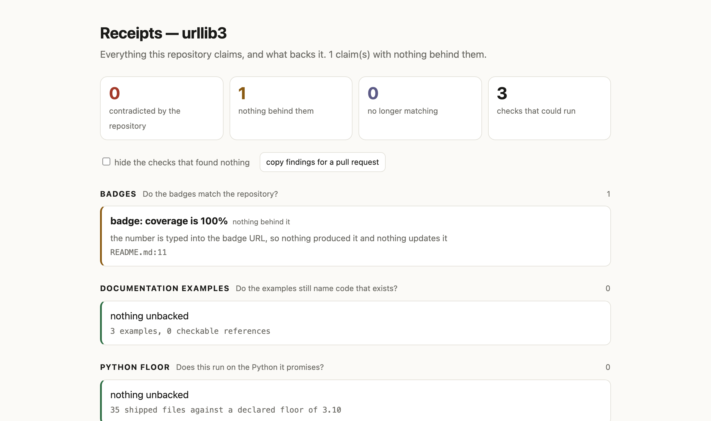

# Receipts

Everything this repository claims, and what backs it.

```bash
./run.sh --repo . --html receipts.html
```

A repository is full of assertions aimed at a stranger: a licence badge, a coverage percentage, a
`requires-python`, an example in the README, a line in the changelog. Each is written once and then
drifts. Tests check behaviour. Linters check style. **Nothing checks the claims.**



## What it checks

| Check | The claim | What backs it |
|---|---|---|
| **badges** | "this project is MIT licensed", "coverage is 100%", "supports Python 3.7+" | the LICENSE file, the packaging metadata — or nothing, when a number is typed into a badge URL |
| **documentation** | "call it like this" | the modules, functions, methods and flags the code defines |
| **python floor** | `requires-python` and the trove classifiers | the syntax the shipped code actually uses |
| **release notes** | "this release fixed X" | the commits in the range |

Three severities, and a fourth list that matters as much:

- **contradicted** — the repository disproves it: the badge says MIT, the LICENSE is Apache;
- **nothing behind it** — a coverage percentage typed into a URL, which nothing produced and
  nothing updates;
- **no longer matches** — two statements of the same fact disagree;
- **not checked** — the question could not be asked here, and the report says why.

Only *contradicted* changes the exit code, so an audit can sit in CI without failing a build over
a stale badge.

Nothing is imported, executed, installed or fetched. Badge claims are read out of their own URLs,
so the whole audit — and the page it writes — works with the network off.

## Found in public repositories

Forty-five projects were audited, everything verified by hand before it was written down. Three
claims did not hold up:

| Project | Claim | What backs it |
|---|---|---|
| **urllib3** | a badge reading `coverage 100%` | the number is written into the badge URL; nothing measured it and nothing updates it |
| **python-docx** | classifiers advertising Python 3.7 and 3.8 | `requires-python` is `>=3.9`, so pip refuses to install on the versions PyPI advertises |
| **pdfplumber** | `python_requires=">=3.8"` | the classifiers start at 3.10, so pip installs on two versions the project no longer says it supports |

Everything else came back clean, which is the result that matters: these are well-kept projects,
and a tool with an opinion about them would simply be wrong.

## Usage

```bash
./run.sh --repo .                          # every check that can run
./run.sh --repo . --only badges version    # just these
./run.sh --repo . --html receipts.html     # a page to send someone
./run.sh --repo . --json                   # the same findings as records
./run.sh --repo . --quiet                  # one line
```

| Exit code | Meaning |
|---|---|
| 0 | nothing the repository contradicts |
| 1 | a claim the repository itself disproves |
| 2 | the path is not a directory |

In CI:

```yaml
- name: audit the claims
  run: ./run.sh --repo . --quiet
```

## The page

The report is one self-contained file: a scorecard, findings first, a filter that hides the checks
that found nothing, and a button that copies the findings as markdown for a pull request comment.
It contains no images, no stylesheet and no request — a badge's URL appears as text, never as a
fetched image, because auditing a claim by loading the thing that makes it would defeat the point.

## What was corrected while building this

- **pip enforces `requires-python`, and nothing else.** The floor had been read as the lowest
  number stated anywhere, and the report said pip honours the lowest. Both wrong; the trove
  classifiers only advertise. python-docx is the live case.
- **A changelog should not mention everything that ships.** Run against httpx, the notes check
  reported a dependabot bump and a test-only commit as unmentioned changes. Both are now excluded,
  along with commits that edited the notes file itself.
- **A decorated class can be given methods at import time.** `@dataclass_json class Person` gets
  `to_json` that way, and an AST walk cannot see it, so those are declared unchecked rather than
  broken.

Each one was found by running the tool against real projects and checking a finding by hand before
believing it.

## Tests

```bash
PYTHONPATH=src python3 -m pytest tests -q   # 36 tests, no network
./check.sh python3.9 python3.12             # the suite and the tool itself, on both versions
./demo/crash-hunt.sh /path/to/clones        # every repository, every output form, exit 1 on any stderr
```

Seventeen of the tests are adversarial: an empty directory, a repository with no Python in it, a
`pyproject.toml` that is not valid TOML, bytes that are not UTF-8, a symlink loop, a dangling
symlink, a README that is one 200,000-character line. Each asserts the same two things — nothing
on stderr, and an exit code of 0 or 1.

One of them runs the tool in a subprocess on purpose. Written in-process it passed whether or not
the code under test was correct, because pytest captures warnings before they reach stderr. A test
that cannot fail is not a test, so it now starts a real process and reads real stderr; reverting
the fix makes it fail.

## How it is put together

The four checkers are vendored under `src/` as libraries — `examplecheck`, `changelogcheck`,
`runson`, `redfirst` — each with its own tests and its own repository. `promises.py` is the only
place that knows their internals: every check returns the same `Section`, so a checker can change
without the report changing with it.

- [example-check](https://github.com/bisale24-ops/example-check) — documentation examples
- [changelog-check](https://github.com/bisale24-ops/changelog-check) — release notes
- [runs-on](https://github.com/bisale24-ops/runs-on) — the Python floor
- [red-first](https://github.com/bisale24-ops/red-first) — mutation testing, not yet wired in

## Honest limits

- It checks the claims it knows how to check. A repository asserts plenty more — in prose, on a
  website, in a video — and this reads none of it. That is why the report ends with what it did not
  ask rather than with a score.
- A badge that resolves remotely is listed and not judged: its claim lives on a server.
- The release-notes check needs at least two tags, so a shallow clone cannot answer it.
- Python only.

MIT licensed. Planned with the Devpost Learn skill pack; `devpost/` holds the scope, PRD and spec
written before the code.
